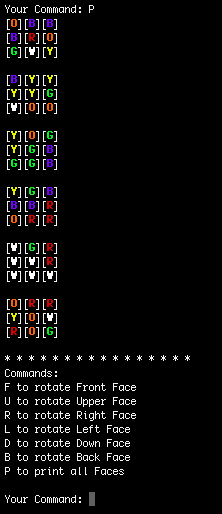
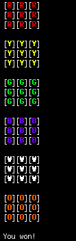

# Rubik's Cube
Play a quick game of Rubik's Cube in your shell!

## Installation
Installing and running is easy: just clone the repo, compile the project, and execute!
```
git clone https://github.com/gamburgm/RubiksCube.git
cd RubiksCube/
make
./main
```
And that's it!

## Usage
The game starts with a randomized cube and instructions to rotate each face. Keep rotating till you've finished!




Each game you play is saved in a `CubeX.txt` file with your moves by default.
